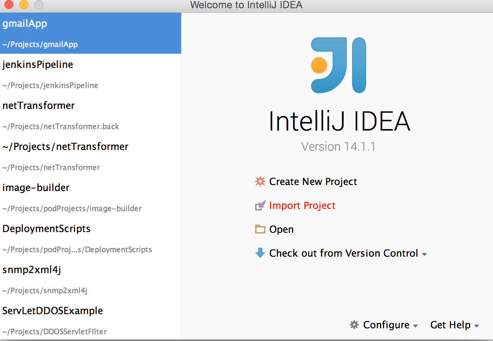
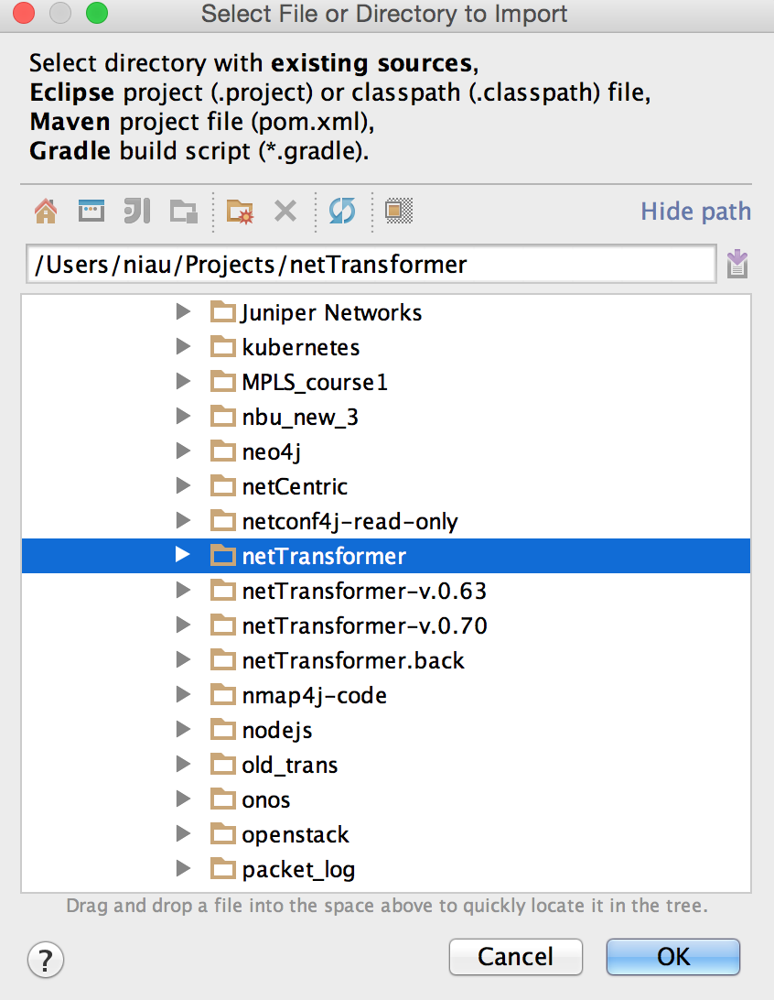
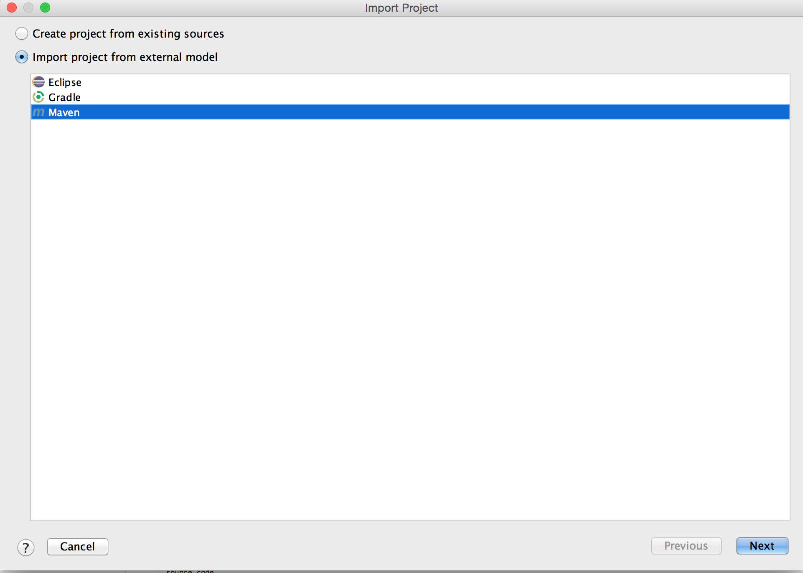
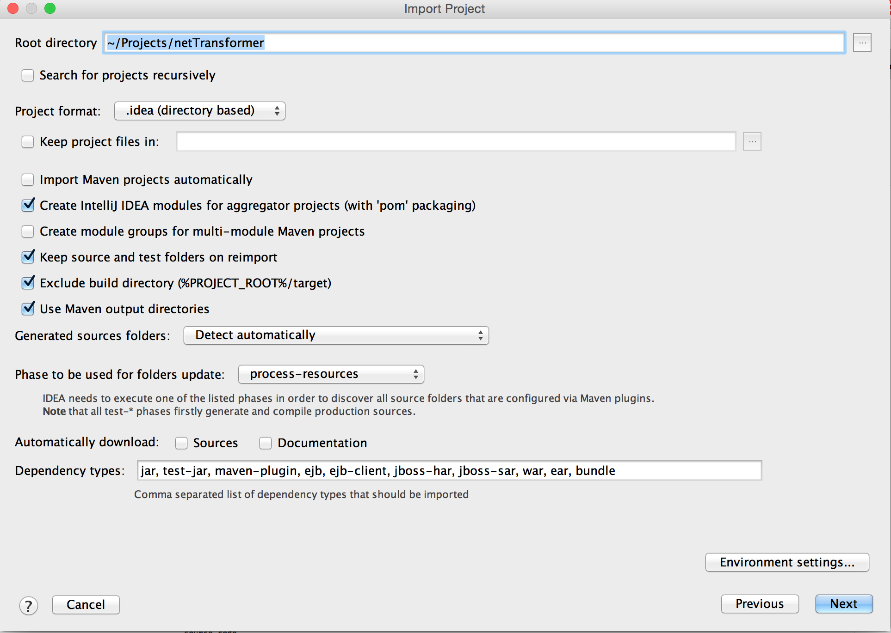
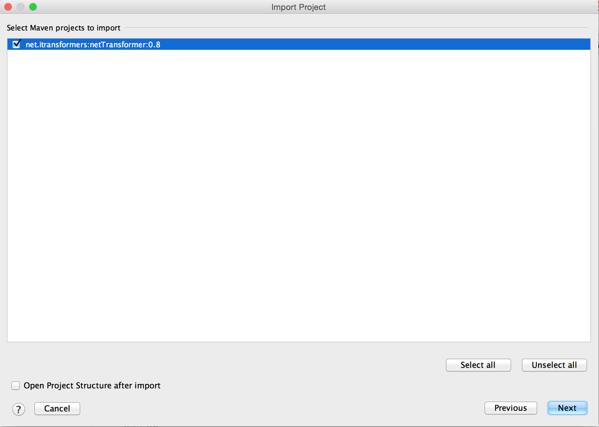
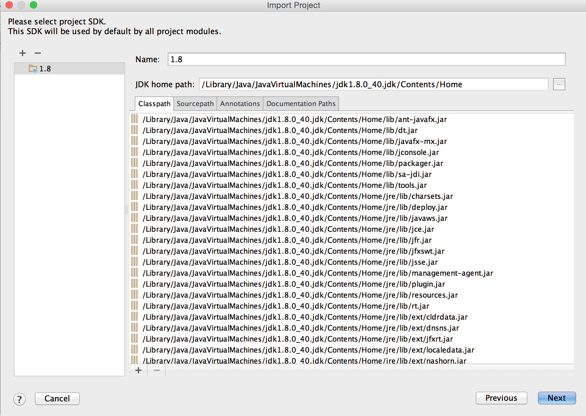
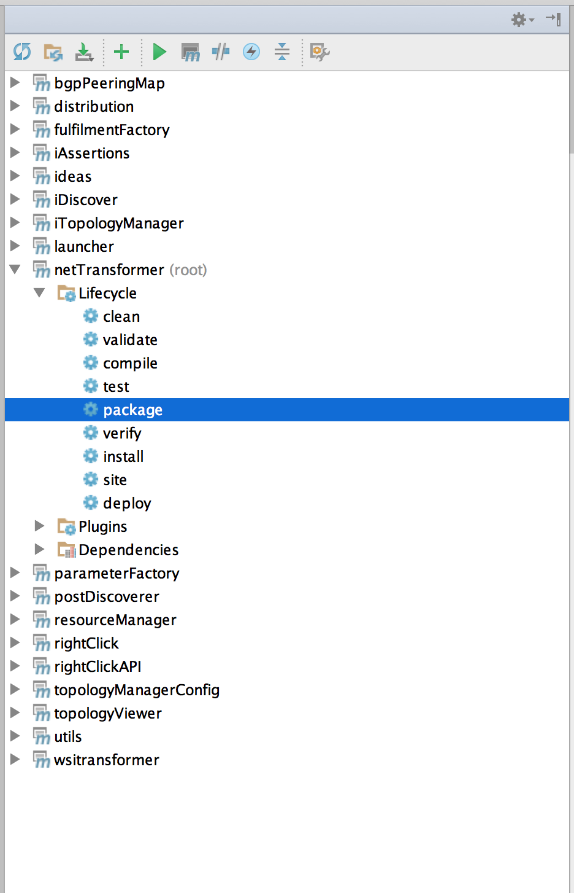
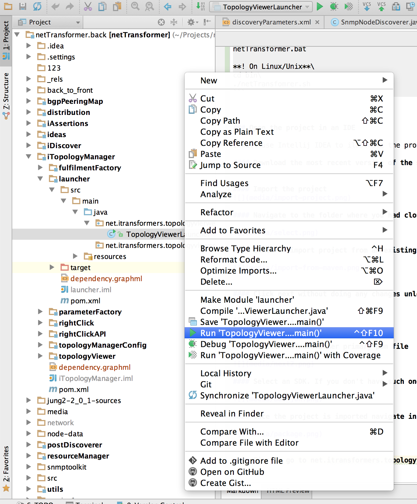

netTransformer
==============
Welcome!

netTransformer is a software prototype able to:
*	Discover networks through various pluggable discoverers (SNMP, JSON, MRT)
*	Capture their state in a graph data model
*	Provide ability to engineers to review and reason about L2, L3, OSPF, ISIS and BGP network topology
*	Automate device configuration process through simplified template interface
*	Track the network evolution process and create network DIFFs between any two network states

If that sounds interesting and you want to find out more please review the [UserGuide](http://www.itransformers.net/UserGuide-Pirin.pdf) or visit our [youtube channel] (https://www.youtube.com/channel/UCVrXTSM9Hj6d3OFbIdF4Z2w). 

Build status 
==============
[ ](https://codeship.com/projects/141650)

Q&A and Issue tracker
==============

 


Getting Started for Developers
==============

### Install java sdk 1.8 or newer. 
Preferably you should use Oracle JDK however with OpenJDK you should also be fine. If not please report an issue to our issue tracker. 

### Get Maven
netTransformer is using maven as a build and dependency management tool. So you should install it. Instructions  [here](http://maven.apache.org/guides/getting-started/maven-in-five-minutes.html)


### Ensure that you have git 
Install [git](https://git-scm.com/book/en/v2/Getting-Started-Installing-Git). Then clone netTransformer source like this. 
```
git clone https://github.com/iTransformers/netTransformer.git
```
Once ready you should have a directory structure similar to the one bellow:

### Build and package from the command line
Build and package netTransformer 
```
cd netTransformer
mvn package
```

### Git it a try and run it
If the process finish successfully navigate to 
```
cd netTransformer/distribution/target/netTransformer-bin/netTransformer/bin
```
Then run it
```
**!On Windows**\
cd bin

netTransformer.bat

**! On Linux/Unix**\
cd bin\
./netTransfomrer.sh
```


### Open the project in an IDE 

I will use Intellij IDEA to ilustrate the process. 

#### Download the most recent version of the software. [Community edition](https://www.jetbrains.com/idea/#chooseYourEdition) is perfectly fine for the purpose.


#### Import the project


#### Navigate to the folder where you had clone netTransformer



#### Click on import project from an existing model (maven pom in our case)




#### Click next without doing any changes unless you know what you are doing :)





#### Select netTransformer primary pom file



#### Select an SDK. If you don't have such one click on the + and import the one you have previously downloaded.



#### Once the project is imported navigate in the right to maven/netTransformer and package the project 




#### Finally go to net.itransformers.topologyvierwer.gui.launcher.TopologyViewerLauncher


 
