**Welcome**
===========

netTransformer is a conceptual software prototype of a network
transformation manager able to:

-   Discover current network infrastructure

-   Capture its state

-   Build a graph data model out of it

-   Provide ability to review and reason about L2, L3, OSPF, ISIS and
    BGP topology

-   Automate device configuration process through simplified template
    interface!

-   Track the network evolution process

-   Transform a network from one state to the other

If that sounds interesting and you want to find out more please read the
rest of this guide or visit our [Youtube
channel](http://www.youtube.com/channel/UCVrXTSM9Hj6d3OFbIdF4Z2w).

netTransformer Ideology
=======================

Each network consists of nodes and edges. The nodes could be devices
that have certain hardware and software, configured in certain way, BGP
autonomous systems part of the Global Internet, human profiles or HTML
in the global WWW. The links could be cables, routing protocols
neighbourships, social links or just links between documents.

The network state can be captured and uploaded in a certain data model.
Once captured the network state could be previewed so YOU (the network
stakeholder) can reason about it. If there is a need, you can even
change it. The change is actually a trigger of a transformation process
to another state. After the change, happens you might want again to
review your current network state, to reason about it and so on until
each and every node and link of the network disappears.

The described lifecycle is nothing else but a transformation from one
state to another. The transformation could happen in many different ways
and could be driven by many different reasons.

Typically each network stakeholders has his own context and his own
reasons why he would like to change certain network state. In the IP
networking world the reason for the change could be for example the
introduction of a new service into the network a network extension to
new geographical areas or the ongoing global network transformations as
the one from IPv4 to IPv6. Another good example of a network
transformation that will happen is from an IP networking world of CLI
(Command Line Interface) warriors to the world of network
programmability known as SDN (Software Defined Networking).

netTransformer is a concept designed specifically to fulfill such
network transformation lifecycles and to help to various Network
stakeholders to perform and track their network evolution
transformations in much more easier and controllable way.

Runtime Environment
===================

[netTransformer](http://itransformers.net/wiki/iTransformer) has been
written in JAVA programming language. It also uses XSLT and GROOVY in
some of its components. It is platform independent and runs and performs
equally well on Linux, Unix, MacOS and Windows operating systems.

Ready, Set and Go
=================

[netTransformer](http://itransformers.net/wiki/iTtransformer) is
designed to setup quickly and without almost any effort. The next couple
of pages will show you how to do this in a couple of easy steps.

The current version of the software can be obtained from the portal for
free software <http://sourceforge.net>.

[http://sourceforge.net/projects/iTransformer/files/latest/download](http://sourceforge.net/projects/itransformer/files/latest/download)

Prerequisites
-------------

Java runtime environment (JRE 1.6.x or newer)

-   There have to be a IP network. Currently netTransformer supports IP
    networks only. To be more specific the software supports IP networks
    that are SNMP version 1 or version 2c enabled. The devices have to
    have common SNMP read community. If you do not know what that is…
    Hmm read
    [here](http://www.paessler.com/manuals/prtg_traffic_grapher/whatisansnmpcommunitystring.htm)
    first…

-   The host on which you are running the
    [netTransformer](http://itransformers.net/wiki/iTtransformer)
    discoverers has to have SNMP connectivity to ANY IP address in
    your network. If there is no such connectivity the software won’t be
    able to discover those parts of your network that are hidden from
    the netTransformer host. The hosts, which do not respond to the SNMP
    queries

-   You have to count to three and to cross your fingers :)

-   The discovery process might take a while. For example SNMP network
    discovery of a network with 8 routers takes a couple of minutes. A
    production network of a medium sized network operator with 500
    routers/switches and thousands of hosts takes about 6 hours. A
    discovery of the entire global BGP peering map might take a couple
    of days.

First run
---------

This guide covers the current version of netTransformer. At the moment
of writing this is version 0.6.

### Step 1 Fire up netTransformer

First and most important step is to fire up the
[**netTransformer**](http://itransformers.net/wiki/iTransformer). It
will discover your network and will populate your inventory data model.
Depending from your operation system go to
[netTransformer](http://itransformers.net/wiki/iTtransformer)\\bin and
execute from the command line the following:

**!On Windows**\
cd bin

netTransformer.bat

**! On Linux/Unix**\
cd bin\
./netTransfomrer.sh

Once you do this netTransformer GUI (Graphical User Interface) will
appear.

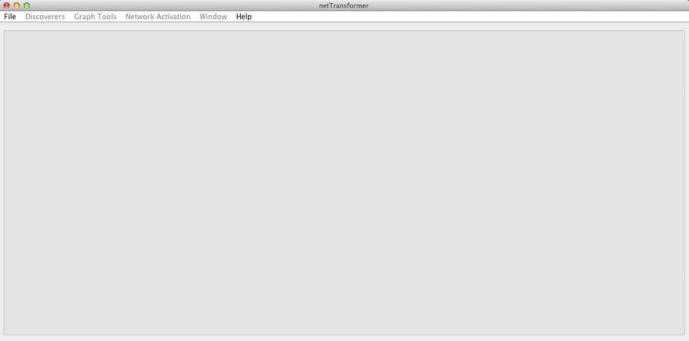{width="5.763888888888889in"
height="2.8541666666666665in"}

Figure netTransformer GUI

Then you will have to create a new network project or to open an
existing one. Note that in the project zip is provided a demo network
project that you can open in order to introduce itself to the software.

### Step 2 Create a new network project

netTransformer introduces the concept that each network has to be
managed as an independent project.

Whatever you do in netTransformer, you do that in the context of a
project. A project is an organizational unit that represents a complete
network solution. Each project consists of certain configuration and
files that represent your network.

To create your first network project go to the file menu and select New
Project.

Figure Create a new project

Then select the project type and choose the path where the new project
will reside. The currently supported project types are netTransformer
and bgpPeeringMap.

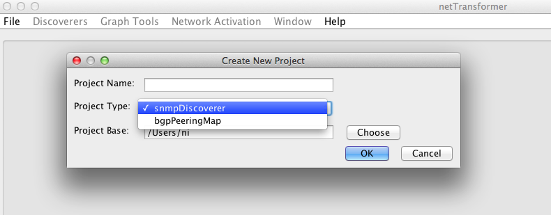{width="5.763888888888889in"
height="2.254166666666667in"}

Figure Choose project type

Hopefully soon will be also released also an SDN (Software Defined
Networking).

If you have chosen as project type netTransformer please proceed to step
3. If you have chosen bgpPeeringMap please proceed to step 5.

### Step 3 Configure SNMP network discovery resources

Go to the Discoverers menu navigate to **SNMP Network Discovery** and
select **Configure Resource**.

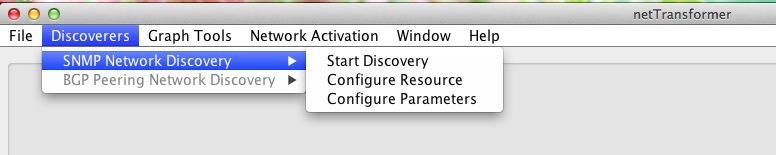{width="5.763888888888889in"
height="1.1513888888888888in"}

Figure SNMP network discovery menu

Once the item opens you have to change the
[SNMP](http://itransformers.net/wiki/SNMP) community strings of the
DEFAULT resource in order to fit to the one in your network.

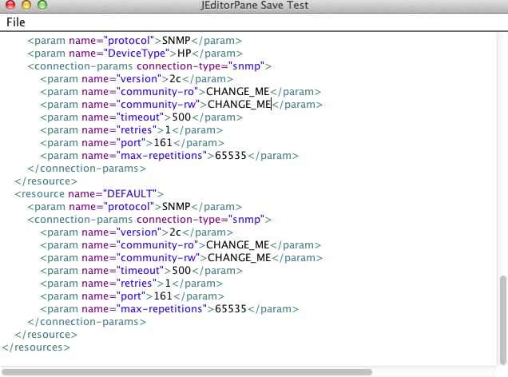{width="5.763888888888889in"
height="4.277777777777778in"}

Figure Configuring SNMP network discovery resources

If all your devices share the same SNMP Communities the default resource
is enough for the discovery of the entire network.

However if certain devices have SNMP security restrictions or respond
slowly to certain large SNMP walks you will need also additional
resources. Each resource can be matched on a combination of parameters
such as DeviceType and DeviceName.

An additional resource that will be used for the discovery of HP devices
part of your network will look like the one shown just bellow the
default resource.

### Step 4 Start SNMP Network Discovery

Go to the Discovery menu and select **Start Discovery**. Enter the IP
address of the initial network device leave the Label empty and hit the
Start button.

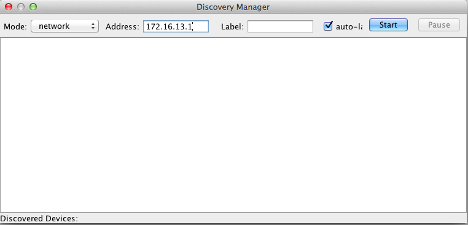{width="6.594224628171479in"
height="3.1759590988626423in"}

Figure Starting a new network discovery

If you have connectivity to the device and if you got the SNMP
communities section right the discovery process will fire up. In the low
left corner you will be able to track the how many devices are
discovered.

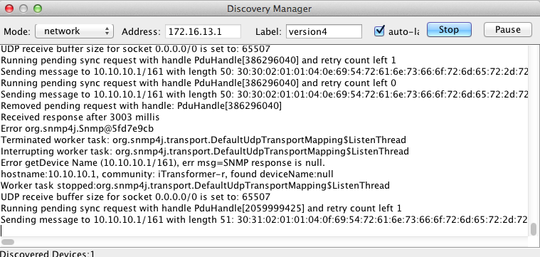{width="6.3023020559930005in"
height="2.9975371828521435in"}

Figure Discovery Process running

Once the discovery process finishes you can proceed to Step number 7.

Note that in large networks you can review the currently discovered
topology prior the process to finish.

### Step 5 Configure BGP peering Map network discoverer

Go to the Discoverers menu navigate to BGP peering Map Network Discovery
and select **Configure Parameters**.

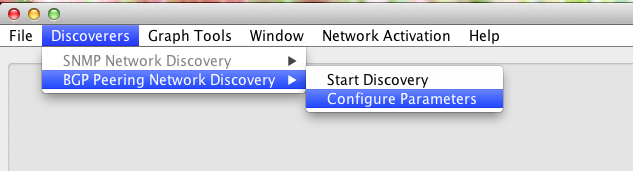{width="5.763888888888889in"
height="1.5569444444444445in"}

Figure BGP peering map network discovery menu

netTransformer configuration editor will appear. Here you have to change
just the SNMP “community-ro” parameter and the timeouts, retries and
max-repetitions values depending of your network device. Do not change
the rest of the parameters if you do not know what you are doing.

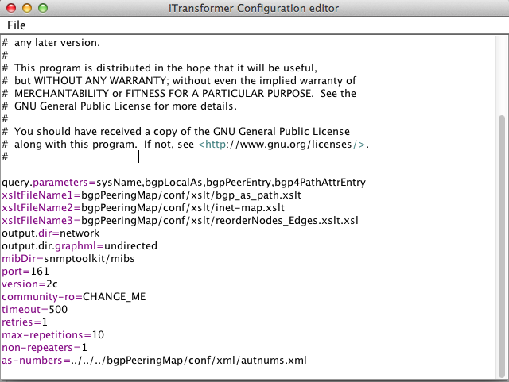{width="5.763888888888889in"
height="4.331944444444445in"}

Figure Configuring BGP peering map parameters

Once ready go to the File menu press Save and Exit and proceed to the
next step.

### Step 6 Start BgpPeeringMap network discovery

Navigate to Start Discovery menu option and enter the BGP router IP
address then press the Start button. This will trigger the discovery
procedure. If the discovery is working correctly you will notice a lot
of output in the console window.

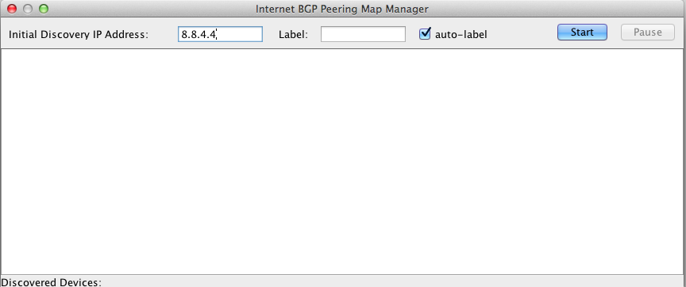{width="5.763888888888889in"
height="2.415277777777778in"}

Figure Starting BGP peering Map network discovery

Note that BGP peering network discovery on a router containing the
global Internet Routing table currently takes several days.

The end of the discovery process is marked by a message like this:

Output Graphml saved in a file
in/Users/demo/bgpPeeringDemo1/network/version4/undirected

Once the process finish you can proceed to step number 7.

### Step 7 Review the discovered Network Topology

Go to the File Menu and choose open graph.

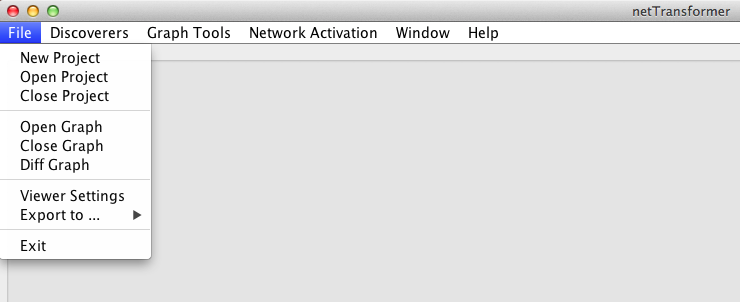{width="5.763888888888889in"
height="2.3520833333333333in"}

Figure Open a network graph

The menu will trigger a dialog in which you should select the folder
containing version1 of the discovered network state. Navigate inside the
version folder and select the undirected.graphmls or directed.graphmls
file. Typically undirected.graphmls file creates a better network view.

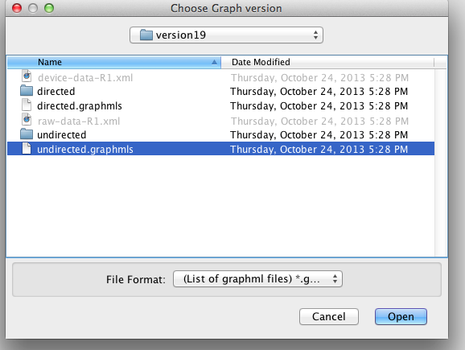{width="5.763888888888889in"
height="4.3381944444444445in"}

Figure Choose a network graph to be open

Once you hit the open button the discovered network topology will be
visualized.

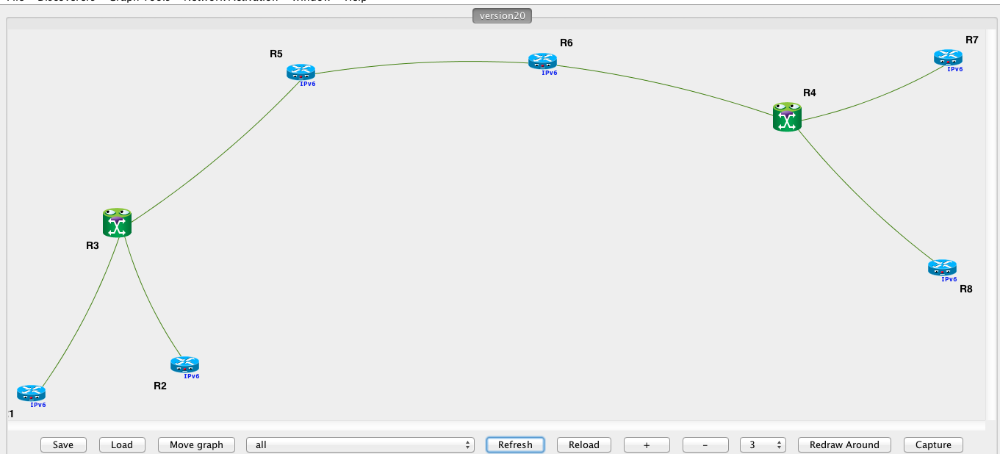{width="5.763888888888889in"
height="2.6173611111111112in"}

Figure Discovered IP Network topology preview

bgpPeeringMap network discovery will create views like those bellow:

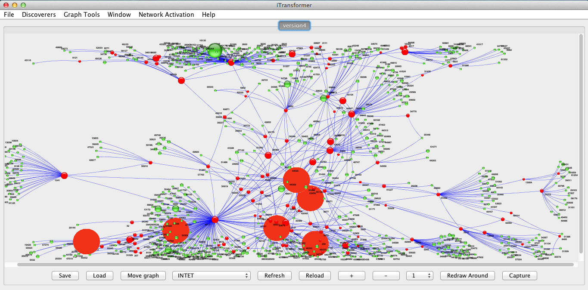{width="5.736111111111111in"
height="2.725462598425197in"}

Figure Discovered BGP peering Map topology preview

The red dots are transit autonomous systems and the green dots are end
autonomous systems. The size of the dot is calculated based on the rank
of the node. Currently the number of the originated IP prefixes
determines the rank.

GUI features, tips and tricks 
==============================

Main menu panel 
----------------

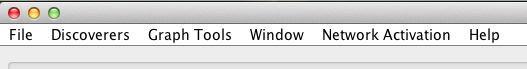{width="5.763888888888889in"
height="0.7548611111111111in"}

Figure Main menu pannel

netTransformer main menu consists of several sub menus described in the
following sections.

### File 

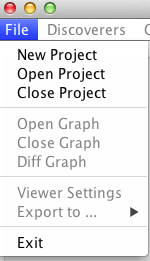{width="1.4694444444444446in"
height="2.548079615048119in"}

Figure File menu

#### Project Management section

**New Project** allows the user to create a new network project. For
more information please refer to **Step 2 Create a new network
project**.

**Open Project** allows the user to open an existing network project.
Once selected the user will be prompted to choose a project file with a
.pfl extension.

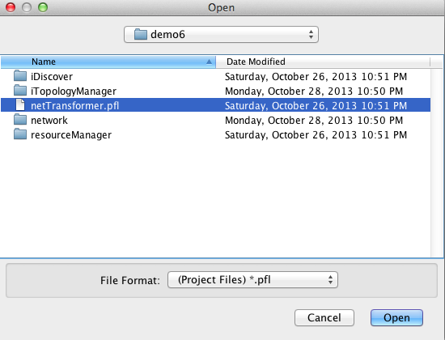{width="5.763888888888889in"
height="4.401388888888889in"}

Figure Open an existing network project

**Close Project** closes an already opened project.

#### Graph Management section

-   **Open Graph** allows the user to open an already discovered version
    of the network. netTransformer allows the user to open multiple
    graphs in multiple tabs.

-   **Close Graph** allows the user to close an already opened graph.

-   **Diff Graph** allows the user to create a network diff between any
    two versions of the discovered network. Once selected the diff
    dialog will appear. Then the user has to select the graphmls file of
    the versions that will be a subject to the diff.

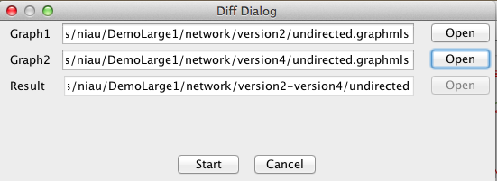{width="5.763888888888889in"
height="2.102777777777778in"}

Figure Configure a network diff

Once the **Start button** has been clicked a diff progress bar will be
displayed.

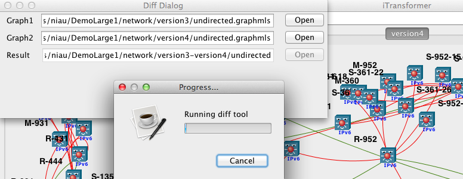{width="4.777777777777778in"
height="2.2465277777777777in"}

Figure Network diff running

Once the diff has finished you will see a view like the one bellow.

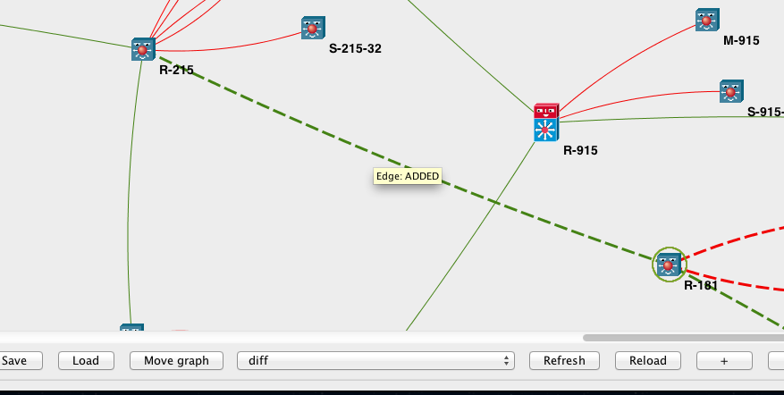{width="5.763888888888889in"
height="2.904861111111111in"}

Figure Graphical representation of a network diff

Note that in order to view the diff tooltips (showing what has been
added, deleted or changed) you will have to select the “diff” filter
from the down panel.

-   **Viewer Settings** - allows the user to edit the Viewer XML file.
    Here you may add new or change existing topology filters, icons and
    node rightclicks. Viewer settings are edited through netTransformer
    configuration manager. More about the principles behind the viewer
    settings configuration could be find in that section

-   **Export to** - allow the user to export the current graph view to a
    jpeg or png image file formats.

-   **Exit -** closes netTransformer

### Discoverers 

#### SNMP Network Discovery 

SNMP Network discovery is the part of netTransformer responsible for
discovering IP networks through SNMP. Its algorithm is designed around
the idea that each network consists of one or more nodes that are linked
between each other. SNMP Network discovery implements a complex network
algorithm based around the idea that giving just a single network node
as an input shall be sufficient for discovering a whole network. It does
not need a range of IP addresses to fire up. That is the main difference
between our discovery and most of the other open or commercial network
discovery tools.

In order certain network to be discovered netTransformer has to have
full network connectivity to each IP address part of the current network
infrastructure and common credentials. In its initial implementation the
algorithm uses just SNMP so in fact to fire up a discovery are needed
SNMP community string/s and an initial IP address.

The algorithm will discover the initial ip address, will find its
neighbors and then will jump up to the neighbor devices will discover
their neighbors and so on until the whole network is discovered.

The discovery is possible by the implementation of various methods for
neighbor network device discovery. Currently the it supports but is not
limited to the following discovery methods:

-   CDP (Cisco Discovery Protocol) - this method is useful for physical
    network discovery in Cisco based network.

-   LLDP (Local Link Discovery Protocol) - this method is useful for
    physical network/data link network topology discovery in Metro
    Ethernet network.

-   ARP (Address Resolution Protocol) - this method is based on ARP
    table neighbors’ discovery. Useful but dangerous in certain cases
    (e.g when the expected network is too large). Use that one
    with care. Have a look on the configuration guide regarding how to
    customize the network discovery requests in order to skip one or
    another method.

-   MAC (Media Access Control) - this method is based on MAC table
    neighbors’ discovery. Useful but dangerous in certain cases (e.g
    when the expected network is too large). Use that one with care.
    Have a look on the configuration guide regarding how to customize
    the network discovery requests in order to skip one or
    another method.

-   MACtoARP - Combination between MAC/ARP tables of the device.

-   Slash30/31 - Method based on calculation of neighbor IP address in
    point-to-point networks.

-   IP routing table discovery - Method based on finding the unique
    neighbor next hops as per IP route SNMP MIB. Note that SNMP MIB on
    which that method is based is already deprecating so maybe better to
    focus on the next method.

-   ip forwarding table discovery That method is based on ip
    forwarding MIB. It contains more then 10 different methods and is
    well document in “New Discovery Methods development Guide”.

-   Open Shortest Path First - Discovering OSPF routing
    protocol neighbors.

-   Border Gateway Protocol - Discovering BGP routing
    protocol neighbors.

More information about how to develop your own SNMP network discovery
method could be found in “New SNMP discovery Methods development Guide”.

#### Configure parameters

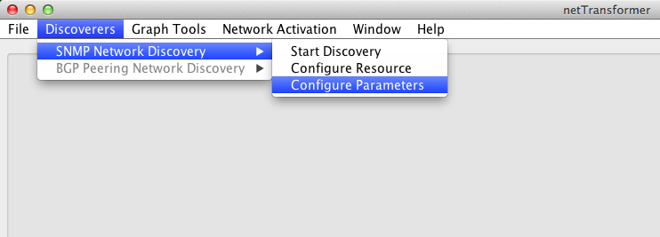{width="5.763888888888889in"
height="2.0743055555555556in"}

Most of the parameters of the SNMP network discoverer are configurable
by this sub menu in fact allows the user to edit the
iDiscover/conf/xml/discoveryParameters.xml file. This file contains
configuration that allows the user to specify different SNMP network
discovery OIDs used for the discovery of various types of devices.

### Graph Tools

#### Layouts

The layouts determine the positional representation of the different
nodes and edges of the graph. Graph layouts influence the
understandability of the network (one of the principles in
netTransformer ideology).

##### FR-Layout

{width="5.763888888888889in"
height="2.6173611111111112in"}

This layout implements the Fruchterman-Reingold force-directed algorithm
for node layout. For more information please have a look on “Fruchterman
and Reingold, ‘Graph Drawing by Force-directed Placement’”,
<http://i11www.ilkd.uni-karlsruhe.de/teaching/SS_04/visualisierung/papers/fruchterman91graph.pdf>

##### KK-Layout

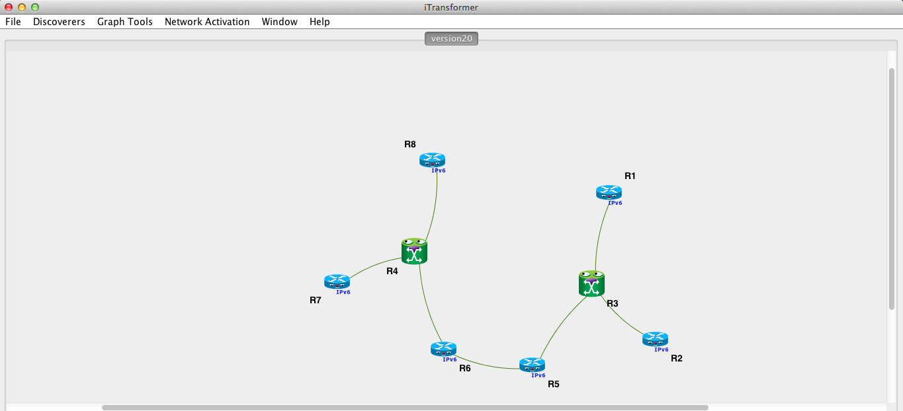{width="5.763888888888889in"
height="2.626388888888889in"}

Implements the Kamada-Kawai algorithm for node layout .

##### Circle Layout

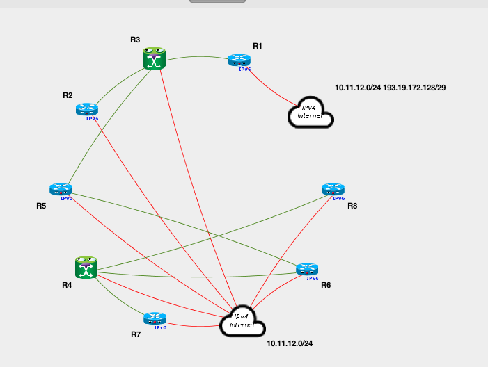{width="5.763888888888889in"
height="4.341666666666667in"}

This Layout implementation positions the nodes equally spaced on a
regular circle.

##### Spring Layout

Spring Layout represents a visualization in which the nodes and edges of
the graph get “alive”. Our implementation follows closely the initial
one part of JUNG

##### ISOM Layout

ISOM layout implements a self-organizing map layout algorithm, based on
Meyer’s self-organizing graph methods .

#### Node Search

-   ##### Search by Name Current graph 

This menu item performs a search into the currently displayed graph. The
user will see a dropdown with the nodes part of the current graph and
has to select a node from it. Once select will be displayed the graph
node properties for the selected node.

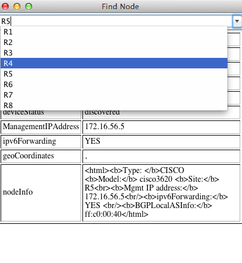{width="5.722222222222222in"
height="5.2555555555555555in"}

-   ##### Search by Name Entire graph

This menu options performs a search into the entire graph. The user will
see a dropdown with the nodes part of the entire graph and has to select
a node from it. Once select will be displayed the graph node properties
for the selected node.

##### Search by Key

##### Search by IP

#### Ranking Algorithms

The ranking algorithms enables network researchers and engineers to
determine the rank of the nodes of the discovered real networks.

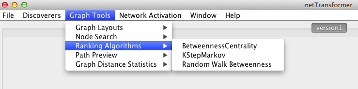{width="5.763888888888889in"
height="1.4354166666666666in"}

The results are displayed in html format that allows the researcher to
copy the values and to use them for further network research.

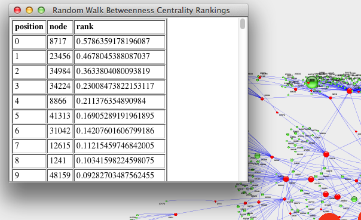{width="5.763888888888889in"
height="3.5215277777777776in"}

-   ##### Betweenss Centrality

Computes betweenness centrality for each vertex and edge in the graph.
Note: Many social network researchers like to normalize the betweenness
values by dividing the values by (n-1)(n-2)/2. The values given here are
unnormalized.

Running time is: O(n\^2 + nm).

More information about that ranking algorithm here “Ulrik Brandes: A
Faster Algorithm for Betweenness Centrality. Journal of Mathematical
Sociology 25(2):163-177, 2001.”

-   ##### KStepMarkov

This ranking algorithm is a variant of PageRankWithPriors that computes
the importance of a node based upon taking fixed-length random walks out
from the root set and then computing the stationary probability of being
at each node. Specifically, it computes the relative probability that
the markov chain will spend at any particular node, given that it start
in the root set and ends after k steps.

###### You can find more information about the algorithm here 

“Algorithms for Estimating Relative Importance in Graphs by Scott White
and Padhraic Smyth, 2003”

-   ##### Random Walk Betweeness

Computes betweenness centrality for each vertex in the graph. The
betweenness values in this case are based on random walks, measuring the
expected number of times a node is traversed by a random walk averaged
over all pairs of nodes.

Running time is: O((m+n)\*n\^2).

“Mark Newman: A measure of betweenness centrality based on random walks,
2002.”

#### Path Preview

Path preview allows network engineers and researchers to compute the
shortest paths between any two nodes in their network.

{width="5.763888888888889in"
height="2.1104166666666666in"}

Currently are supported two algorithms. Internally developed shortest
path and the classic Dijkstra shortest path.

Each one will ask you for an A and B nodes.

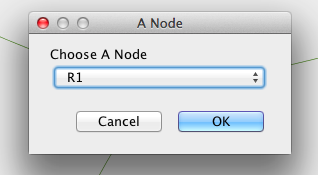{width="4.416666666666667in"
height="2.4305555555555554in"}

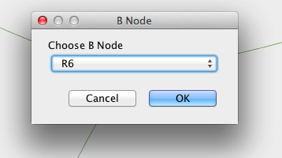{width="4.494888451443569in"
height="2.511111111111111in"}

Finally the shorthest path will be displayed.

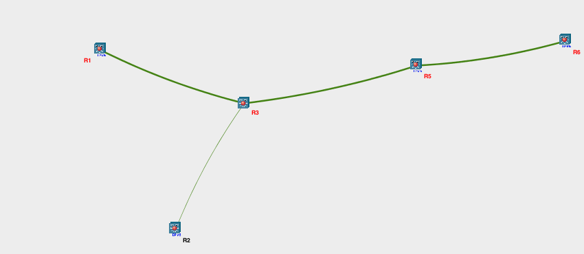{width="5.763888888888889in"
height="2.509027777777778in"}

### Network Activation

This menu allows the user to configure everything related to the
configuration of the network activation.

#### Configure Parameters

This submenu allows the user to configure various parameter-factories
parameter factories are used for supplying with parameters the network
activation. Parameters could be manual, from device-xml, from graphml or
parameters part of the currently loaded into the memory graph.

#### Configure Resources

This submenu allows the user to configure various resources used for
communication with the network. Note that the template interface
currently supports only telnet protocol.

#### Configure Bindings

This submenu allows the user to do the binding between the template with
a parameter-factory and resource.

#### Configure Templates 

This submenu allows the user to open or create new network activation
templates.

### Window

#### New Tab

#### Close Tab

#### Close Other Tabs

#### Close All Tabs

### Help 

##### User Guide

##### About

Graph management panel 
-----------------------

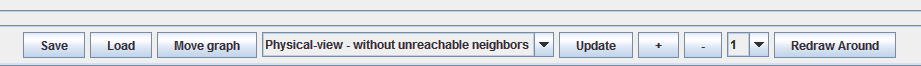{width="5.763888888888889in"
height="0.4162806211723535in"}

Figure Graph management pannel

**Save** – saves the topology graph layout to a file.

**Load** – loads the saved layout 

**Move graph** – allows the user to move of the whole topology 

**Filters Selection** – allows selection of different topology filters. 
Filters give you the possibility to reason about the network as per
certain topology view. For example there are filters that will allow you
reason about your Layer 2 topology or about your OSPF or BGP topologies.

**Refresh** - Redraws the current topology picture
--------------------------------------------------

**Reload** – Reloads the network inventory information. If there are
newly discovered devices they will be picked up and displayed on your
screen next to the current one.

**Plus/Minus** - Zoom in/Zoom out
---------------------------------

**Redraw Around** – redraws the network to a certain number of hops
around one or more selected nodes. The feature is useful when you want
to reason only about a particular set of nodes.

RightClicks
-----------

There are a number of functionalities available when the user right
clicks on one or more than one selected network topology nodes.

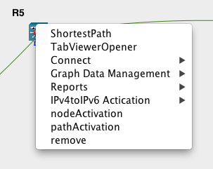{width="4.208333333333333in"
height="3.3472222222222223in"}

Figure RightClick Menu

############################## Shorthest Path

Calculates the shorthest path between the current node and a B node.

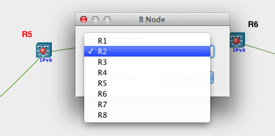{width="5.763888888888889in"
height="2.8513888888888888in"}

Figure Shorthest Path rightclick

Once the B node selected it will draw the shortest path between the node
on which you have performed the rightclick (A node) and the destination
(B node).

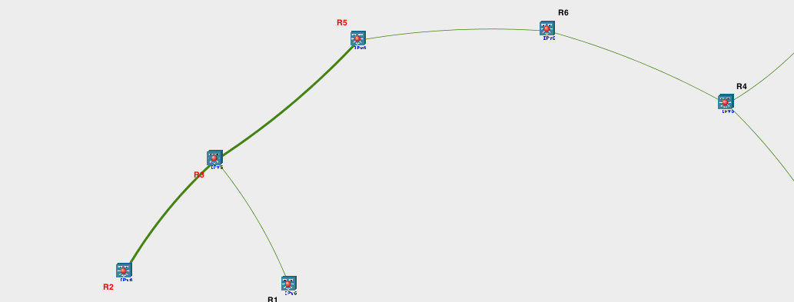{width="5.763888888888889in"
height="2.1930555555555555in"}

Figure Shorthest path preview

############################## TabViewerOpener 

This is a rightclick able to open a new tab with the same network graph.
The same feature is available from the Window/ New Tab menu. This will
allow you to improve the reasoning about the network by having different
network views of the same network in different tabs. For example in one
tab you may have a view of the OSPF network and in another of the BGP.

############################## Connect 

Connect rightclicks allows the user to perform manual connects to the
selected node through various methods and protocols. Currently are
supported - telnet and ssh through putty, http/https through opening a
new tab in a browser and SSHv2 through a JConsole.

{width="5.763888888888889in"
height="3.1840277777777777in"}

Figure Connect through

######################################## Console\_SSH2

This rightclick opens an SSH v2 session in Java console to the selected
node. It uses the resources accessible through the Network Activation
menu in order to perform a basic login to the device.

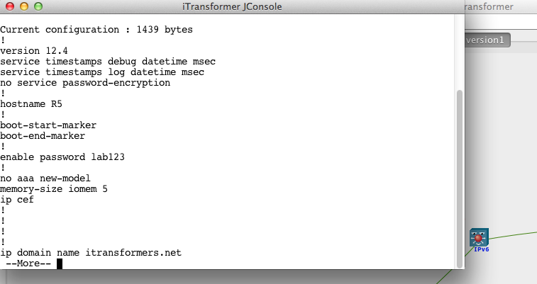{width="5.763888888888889in"
height="3.053472222222222in"}

Figure JConsole window

######################################## HTTP/HTTPs

HTTP/HTTPs rightclicks will open http or https connections through your
default browser to the management IP address of the selected node to a
specific port. The exact port is configurable in Viewer Settings.

&lt;rightClickItem name=”HTTP”
handlerClass=”net.iTransformers.topologyviewer.rightclick.impl.URLRightClickOpener”&gt;

&lt;param name=”protocol”&gt;http&lt;/param&gt;

&lt;param name=”port”&gt;8080&lt;/param&gt;

&lt;/rightClickItem&gt;

&lt;rightClickItem name=”HTTPS”
handlerClass=”net.iTransformers.topologyviewer.rightclick.impl.URLRightClickOpener”&gt;

&lt;param name=”protocol”&gt;https&lt;/param&gt;

&lt;param name=”port”&gt;443&lt;/param&gt;

&lt;/rightClickItem&gt;

######################################## Putty

Another useful rightclick invokes putty. Putty is an example for
external application integrated in iTopoManger. It allows network
administrator to perform manual topology driven configuration of the
devices in their networks.

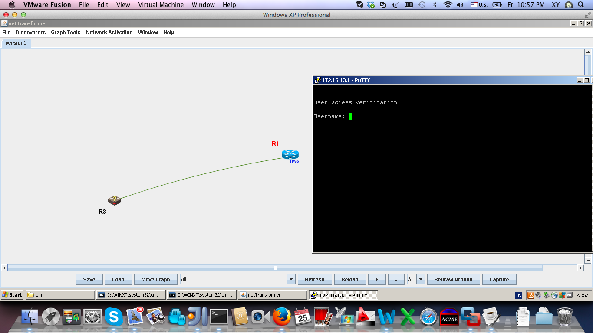{width="4.5777777777777775in"
height="3.311111111111111in"}

Figure Putty

The putty rightclick handler performs automatic credentials selection
from the same resource.xml file located as the one used for network
activation. Resource configuration and handling is described in more
details in netTransformer’s configuration guide.

PuttyRightClick handler allows direct communication with network devices
or communication through a proxy.

&lt;rightClickItem name=”putty”
handlerClass=”net.iTransformers.topologyviewer.rightclick.impl.PuttyRightClickHandler”&gt;

&lt;param
name=”puttyRelativePath”&gt;../lib/putty/putty.exe&lt;/param&gt;

&lt;param name=”ssh\_no\_saved\_session”&gt;-ssh -l %s -pw %s
%s&lt;/param&gt;

&lt;param name=”ssh\_saved\_session”&gt;-ssh -l %s -pw %s -load %s %s
&lt;/param&gt;

&lt;param name=”telnet\_no\_saved\_session”&gt;-telnet -l %s
%s&lt;/param&gt;

&lt;param name=”telnet\_saved\_session”&gt;-telnet -l %s -load %s
%s&lt;/param&gt;

&lt;param
name=”resource”&gt;resourceManager/conf/xml/resource.xml&lt;/param&gt;

&lt;param name=”saved\_session”&gt;&lt;/param&gt;

&lt;/rightClickItem&gt;

**Note:** The putty works only in windows environments. Thus it won’t
open anything in linux or windows environments.
\_\_\_\_\_\_\_\_\_\_\_\_\_\_\_\_\_\_\_\_\_\_\_\_\_\_\_\_\_\_\_\_\_\_\_\_\_\_\_\_\_\_\_\_\_\_\_\_\_\_\_\_\_\_\_\_\_\_\_\_\_\_\_\_\_\_\_\_\_\_\_\_\_\_\_\_\_\_\_\_\_\_

############################## Reports

As the names suggest the Reports rightclick allow you to display various
report information about the discovered network node.

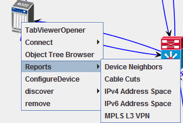{width="3.2555555555555555in" height="2.2in"}

Figure RightClick Reports

######################################## Device Neighborship Report

> 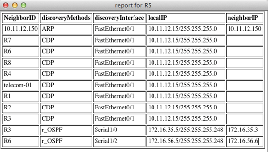{width="5.725in" height="3.2416666666666667in"}
>
> Figure
> DeviceNeighborship report
>
> Device Neighborship report contains information about device Neighbors
> and the methods through that they are discovered. The third column
> provides information about the discovery Interfaces. If the neighbor
> is logical (e.g Routing protocol Neighbor) no discoveryInterface will
> be displayed.

######################################## CableCut Report 

CableCut is a device port state in which the Administrative Status of
the port is UP but the operational one is down. E.g there is a problem
with the physical link. The report contains three columns -
InterfaceName, AdministrativeStatus (UP) and operStatus (DOWN).

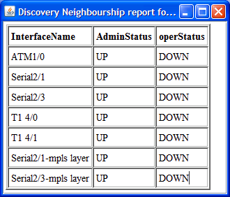{width="3.433333333333333in"
height="2.933333333333333in"}

Figure CableCut report

######################################## IPv4 Address Space Report

That report provides information about the current IPv4 address ranges
on the device and the interfaces on that they are used. The report has
four columns - Subnet (Range Subnet and Range Subnet Mask), IPv4Address
(the IP address reserved in that IP range), SubnetMask (in four octet
notation) and the Interface Name.

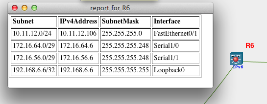{width="5.763888888888889in"
height="2.2527777777777778in"}

Figure IPv4 Address Space
report

######################################## IPv6 Addressing Report

That report provides information about the current IPv6 address
allocations on the device and the interfaces on that they are used. The
report has five columns - IPv6 Address, SubnetMask, ipv6AddrType - the
type of the address, ipv6AddrAnycastFlag - is the address anycast or not
and the Interface Name.

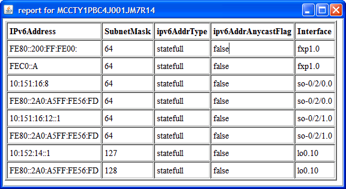{width="5.944444444444445in"
height="2.9555555555555557in"}

Figure IPv6 Address Space
report

######################################## MPLS L3 VPN Report

MPLS L3 VPN contians information about MPLS L3 vpns configured on the
particular node. It contains four columns - vrfName (the name of the
VRF), RD - Route Distinguisher, RT -Route Target, Interfaces (Interfaces
on that the VRF has been applied.

Figure MPLS L3 VPN

############################## Graph Data Management

######################################## Object Tree Browser 

This rightclick creates an object oriented xml database inventory model
of network devices there has to be a way this information to be
revealed. The object browser is a useful tool that displays xml device
xml filled in java tree GUI outlook.

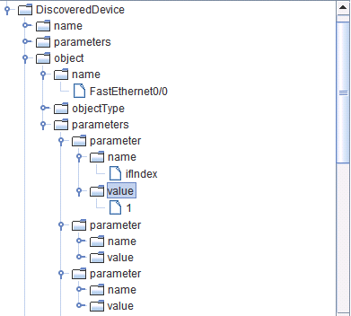{width="4.0777777777777775in"
height="3.6666666666666665in"}

Figure ObjectTreeBrowser

############################## Node&Path Activation

PuttyRight Click handler allows manual device configuration.
netTransformer aims controlled network transformation from one state to
the other. To do so it has to change device configurations not manually
through putty but through much more automated configuration engine. The
Node and Path activation are the first step in that direction. Prior
activating anything in your network you have to configure the resources
for communication with the it, to create network configuration
templates, determine from where the configuration parameters will come
from and finally to bind that together (). one is demonstrated how to
use it. The typical sequence of events is

1.  Select one or more than one network nodes.

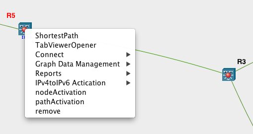{width="5.763888888888889in"
height="3.057638888888889in"}

1.  Then click on node or path activation rightclicks and select one of
    the previously configured templates.

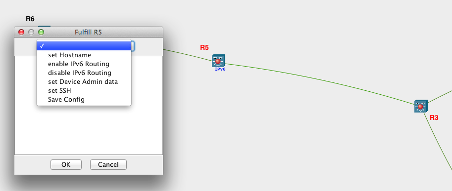{width="5.763888888888889in"
height="2.4430555555555555in"}

Figure Invoke Node Activation rightclick and select set Hostname

Once you do that you will be asked for manual parameter input if there
is such or if there isn’t the network activation will happen.

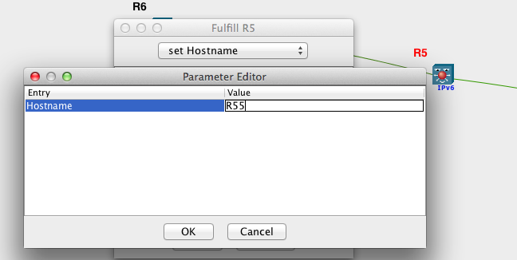{width="5.763888888888889in" height="2.9in"}

Figure Pass Manual Input
parameters to set Hostname

As a final result you will see a dialog with the communication with the
network device. Currently it is quite rough but hopefully in the next
version we will be able to give you something much better.

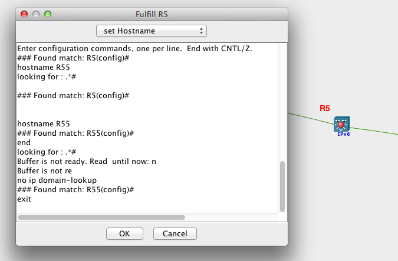{width="5.763888888888889in"
height="3.7916666666666665in"}

Figure The final result of invoking a template

Here comes the question but how can be ensured that the network really
changed its state and the configuration engine actually worked. That
question could be answered in several different ways. The most obvious
answer is “Please use the putty or JConsole rightclicks to login to the
device and verify its configuration and current state”. Another way is
to use again the same engine and issue a verification command that will
verify does the new configuration work or not. An example for such one
could be ping, traceroute or some other verification/display command.
The third option is to preform a new network discovery and to compare
the two versions of the network through the network diff functionality.

In the example bellow R5 has disappeared due to the change of hostname
and R55 has appeared. The same could be said for the links between the
node and R3 and R6.

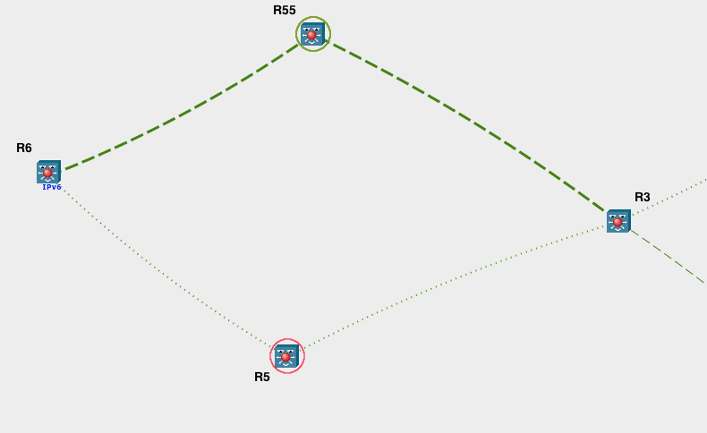{width="3.513888888888889in"
height="2.1527865266841646in"}

Figure Perform a network diff after a hostname change

############################## Remove 

As the name suggests that rightclick removes the selected nodes/edges
from the graph view.

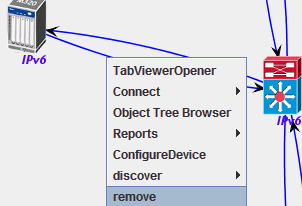{width="3.1444444444444444in"
height="2.1444444444444444in"}

Figure Remove RightClick

########## netTransformer files

The current implementation of netTransformer does not use any kind of a
database instead it is using xml structures stored in files on the file
system. In this chapter we will walk over the different kinds of files
created by it. All files that are created during each discovery process
will be stored under the respected network/version folder in your
netTransformer project.

#################### Raw data files

Raw data files are located directly under the network/version folder in
your netTransformer project. They contain structured xml that represents
the direct communication with the network device. The example bellow
shows raw data generated by the SNMP network discoverer.

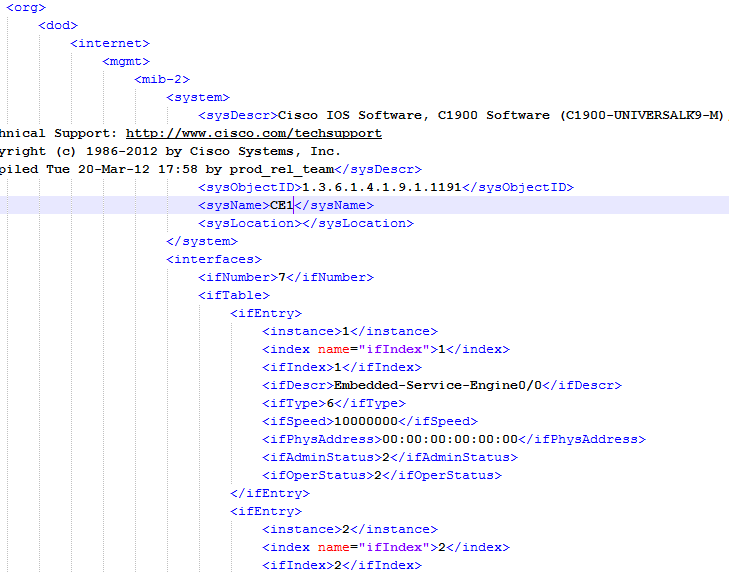{width="5.041666666666667in"
height="3.9543678915135607in"}

Figure SNMP Raw data file

#################### Device xml files

Device xml are generated by the SNMP network discovery through a
transformation of the raw-data files and are located under the under the
network/version folder in your netTransformer project.

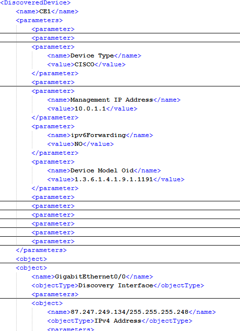{width="3.5208333333333335in"
height="4.856155949256343in"}

Figure device xml file

#################### Graphml files

Graphml files follow the graphml file format as defined in . They are
generated by transforming the device.xml files in the case of
netTransformer and are used by netTransformer viewer in order to
generate the network views.

Each node or edge described in the graphml is represented by a node/edge
id and a number of data
keys. Typical list might contain data keys as deviceModel, deviceType,
deviceStatus, ManagementIPAddress, site, geoCoordinates and deviceInfo.
The complete list of node properties for any device could be reviewed
from the graphml file for the particular device through the Graph data
management/Graphml viewer rightclick.

&lt;node id="C7"&gt;

&lt;data key="hostname"&gt;C7&lt;/data&gt;

&lt;data key="deviceModel"&gt;cisco2611&lt;/data&gt;

&lt;data key="deviceType"&gt;CISCO&lt;/data&gt;

&lt;data key="deviceStatus"&gt;discovered&lt;/data&gt;

&lt;data key="ManagementIPAddress"&gt;10.11.222.2&lt;/data&gt;

&lt;data key="site"&gt;Moskow&lt;/data&gt;

&lt;data key="geoCoordinates"&gt;23.13661,12.687546&lt;/data&gt;

&lt;data key="ipv6Forwarding"&gt;NO&lt;/data&gt;

&lt;data key="deviceInfo"&gt;&lt;!\[CDATA\[ &lt;html&gt;&lt;b&gt;Type:
&lt;/b&gt;CISCO &lt;b&gt;Model:&lt;/b&gt; cisco2611
&lt;b&gt;Site:&lt;/b&gt; C7&lt;br&gt;&lt;b&gt;Mgmt IP address:&lt;/b&gt;
10.11.2.2&lt;br/&gt;&lt;b&gt;ipv6Forwarding:&lt;/b&gt;
NO&lt;b&gt;BGPLocalASInfo:&lt;/b&gt; 0&lt;/html&gt;\]\]&gt;&lt;/data&gt;

&lt;/node&gt;

Config Example Node data keys (from graphml)

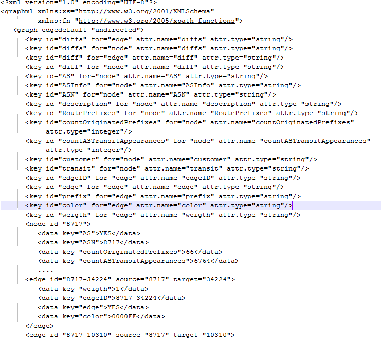{width="5.756944444444445in"
height="5.159722222222222in"}

########## netTransformer Configuration guidelines

Note that if you want to edit the configuration on per project basis you
have to edit either of the files bellow located in your project folders.
If you want to edit the files that will be used for the instantiation of
those configuration files in multiple project you have to edit the
located in primary netTransformer location.

#################### Configure snmpNetwork discovery projects

############################## Configure SNMP discovery parameters

Discovery-helper allows customization of the SNMP requests for each
deviceType that might be found in the network. The current discovery
process retrieves device hostname and type. Once it knows the type it
can choose the rest of the request. If the device is from an unknown
type it will always assemble the “Default” request. Current discovery
support Cisco, Juniper, Huawei, HP, and Tellabs devices.

Each device section has several subsections. Discovery users might
delete some of the SNMP requests from some of the sections or the whole
section completely but can not change section names. For example if ARP
requests are not needed for certain deviceType has to be delete
ipNetToMediaTable from PHYSICAL discovery section. This way of
configuration allows network administrator really to fine-tune the
requests towards any network devices.

&lt;discovery-helper&gt;

&lt;device type="DEFAULT"
xslt="iDiscover/conf/xslt/transformator.xslt"&gt;

&lt;!-- Contain snmp oid names needed for general device description
--&gt;

&lt;general&gt;

ifIndex,ifDescr,ifOperStatus,ifAdminStatus,ifNumber,ifPhysAddress,ifType,dot1dTpFdbAddress,system,ipAddrTable,ifIndex,
ifName

&lt;/general&gt;

&lt;!-- Contain parameteters needed for physical description of the
device and physical discovery methods --&gt;

&lt;discovery-method name="PHYSICAL"&gt;

dot1dBaseBridgeAddress,dot1dStpDesignatedRoot,
dot1dStpPortEntry,dot1dTpFdb,dot1dTpFdbStatus,dot1dTpFdbPort,dot1dBasePort,dot1dBasePortIfIndex,ipNetToMediaTable,lldpRemoteSystemsData,cdpCacheDevicePort,cdpCacheDevicePlatform,cdpCacheDeviceId,cdpCacheIfIndex,cdpCachePrimaryMgmtAddrType,cdpCachePrimaryMgmtAddr,
dot1qVlanStaticEntry

&lt;/discovery-method&gt;

&lt;!-- Contain request parameters needed for next-hop discovery methods
--&gt;

&lt;discovery-method name="NEXT\_HOP"&gt;

ipRouteIfIndex, ipRouteNextHop

inetCidrRouteType, inetCidrRouteIfIndex, inetCidrRouteNextHop,
inetCidrRouteProto, inetCidrRouteNextHopAS

&lt;/discovery-method&gt;

&lt;!-- Contain request parameters needed for OSPF discovery methods
--&gt;

&lt;discovery-method name="OSPF"&gt;

ospfRouterId,ospfNbrEntry,ospfAdminStat,ospfVersionNumber,ospfAreaBdrRtrStatus,ospfASBdrRtrStatus,ospfAreaTable,ospfIfEntry

&lt;/discovery-method&gt;

&lt;discovery-method name="BGP"&gt;

bgpLocalAs,bgpPeerEntry

&lt;/discovery-method&gt;

&lt;discovery-method name="ISIS"&gt;

isisISAdjIPAddrEntry

&lt;/discovery-method&gt;

&lt;discovery-method name="RIP"&gt;

rip2IfConfTable,rip2IfStatTable

&lt;/discovery-method&gt;

&lt;discovery-method name="ADDITIONAL"&gt;

mplsVpnVrfName,mplsVpnVrfRouteDistinguisher,mplsVpnVrfRouteDistinguisher,

dot1dBaseNumPorts, dot1qVlanStaticTable

&lt;/discovery-method&gt;

&lt;discovery-method name="IPV6"&gt;

ipv6Forwarding, ipv6IfIndex,
ipv6AddrEntry,ipv6NetToMediaEntry,ipv6RouteEntry

&lt;/discovery-method&gt;

&lt;/device&gt;

&lt;/discovery-helper&gt;

Config Example 2 DiscoveryParameters xml

To add new device just add a new devicetype section to the file and
specify a xslt transformation file that will transform the raw data xml
gathered from the devices with that type.

&lt;device type="NEW\_DEVICE"
xslt="iDiscover/conf/xslt/transformator.xslt"&gt;

&lt;/devicetype&gt;

Config Example 3 Adding new device to DiscoveryParameters xml

Each discoverytype contains a general section that contains SNMP OID
names general device parameters and several other discoverymethods. If
you want to customize discovery methods just add your SNMP OIDS to the
current one. If those are not enough and a new method has to be
implemented add a new discovery-method section to the deviceType that
might support the method.

&lt;discovery-method name="NEW\_METHOD"&gt;

SNMP\_OID\_NAME\_1, SNMP\_OID\_NAME\_X….

&lt;/discovery-method&gt;

Config Example 4 Adding new discovery method to certain device in
DiscoveryParameters xml

discoveryParameters.xml contains also another section that specifies a
set of stop criteria rules. Stop criteria specify what to be discovered
and what to not be discovered.

For example if all devices with hostnames starting with CE shall not be
discovered the stop criteria has to match the hostname with a regex
match.

If discovery has not to discover devices from certain range the match
rule has to regex that IP range. An interesting combination is the regex
“.\*” “Match rule for all ip addresses”.

&lt;match property="host"&gt;CE\*&lt;/match&gt;

&lt;match property="ipAddress.ipAddress"&gt;.\*&lt;/match&gt;

&lt;match-not
property="ipAddress.ipAddress"&gt;10\\..\*&lt;/match-not&gt;

&lt;match-not
property="ipAddress.ipAddress"&gt;172\\..\*&lt;/match-not&gt;

&lt;match-not
property="ipAddress.ipAddress"&gt;192\\.168.\*&lt;/match-not&gt;

Config Example 5 Discovery Stop Criteria

In this case discovery process will run itself only on devices with
private ip addresses.

Note that everything that is matched will not be discovered and
everything that is matched will be discovered.

############################## Viewer Settings

Viewer settings contains configuration for icons, filters, tooltips and
rightclicks required for normal netTransformer GUI viewer operation.

Viewer settings configuration file is network specific. For IP networks
discovered through SNMP it located in
iTopologyManager/topology-viewer/conf/xml/viewer-config.xml.

######################################## Icon selection

Each device has to be correctly presented as a graph node with a
specific icon. Icon selection is based on node data key match. One or
more data keys of the node choose the icon. The major rule is - first
icon matched is selected. That means icons that have more properties
have to be in configuration prior those that might match on smaller
number of properties. If no icon is matched a default icon will be used.

&lt;!--TELLABS--&gt;

&lt;icon name="/images/76xx.png,,/images/circle\_red\_big.png"&gt;

&lt;data key="deviceType"&gt;TELLABS&lt;/data&gt;

&lt;data key="diff"&gt;REMOVED&lt;/data&gt;

&lt;/icon&gt;

&lt;icon name="/images/76xx.png,/images/circle\_green\_big.png"&gt;

&lt;data key="deviceType"&gt;TELLABS&lt;/data&gt;

&lt;data key="diff"&gt;ADDED&lt;/data&gt;

&lt;/icon&gt;

&lt;icon name="/images/76xx\_ipv6.png,/images/circle\_blue\_big.png"&gt;

&lt;data key="deviceType"&gt;TELLABS&lt;/data&gt;

&lt;data key="diff"&gt;YES&lt;/data&gt;

&lt;data key="ipv6Forwarding"&gt;YES&lt;/data&gt;

&lt;/icon&gt;

&lt;icon name="/images/76xx.png,/images/circle\_blue\_big.png"&gt;

&lt;data key="deviceType"&gt;TELLABS&lt;/data&gt;

&lt;data key="diff"&gt;YES&lt;/data&gt;

&lt;/icon&gt;

&lt;icon name="/images/76xx\_ipv6.png"&gt;

&lt;data key="deviceType"&gt;TELLABS&lt;/data&gt;

&lt;data key="ipv6Forwarding"&gt;YES&lt;/data&gt;

&lt;/icon&gt;

&lt;icon name="/images/76xx.png"&gt;

&lt;data key="deviceType"&gt;TELLABS&lt;/data&gt;

&lt;/icon&gt;

&lt;!--Output omitted--&gt;

&lt;!--Default icon--&gt;

&lt;icon name="/images/unknown\_switch.png"&gt;

&lt;/icon&gt;

Config Example topology-viewer - Icon Definition

######################################## Filters

Each filter selects nodes and edges based on their data key properties.
Simple filter definition is presented below. Each user might create its
own filters specifying different combination of dataKeys. Note that
firstly positioned filter is always used for the initial network
display.

&lt;filter name="Physical-view - without unreachable neighbors"&gt;

&lt;include dataKey="deviceStatus" dataValue="discovered"
for="node"/&gt;

&lt;include dataKey="deviceStatus" dataValue="initial" for="node"/&gt;

&lt;include dataKey="method" dataValue="NEXT\_HOP" for="edge"/&gt;

&lt;include dataKey="method" dataValue="CDP" for="edge"/&gt;

&lt;include dataKey="method" dataValue="LLDP" for="edge"/&gt;

&lt;include dataKey="method" dataValue="Slash30" for="edge"/&gt;

&lt;include dataKey="method" dataValue="Slash31" for="edge"/&gt;

&lt;include dataKey="method" dataValue="MAC" for="edge"/&gt;

&lt;/filter&gt;

Config Example viewer-config.xml filter
definition

######################################## Tooltips 

Each filter view allows the selection of a certain edge/node tooltip. If
no tooltip is specified a default one is used.

&lt;tooltip dataKey="nodeInfo" for="node"
transformer="net.itransformers.topologyviewer.nodetooltip.HTMLCSVNodeTooltipTransformer"/&gt;

&lt;tooltip dataKey="method" for="edge"
transformer="net.itransformers.topologyviewer.edgetooltip.CSVEdgeTooltipTransformer"/&gt;

Config Example default Tooltips for nodes and edges

If a specific tooltip has to be specified for certain filter the tooltip
tag has to be added to the filter configuration.

&lt;filter name="IPLinkLayer-reachable+unreachable"&gt;

&lt;include dataKey="ipLink" dataValue="YES" for="edge"/&gt;

&lt;tooltip dataKey="deviceInfo" for="node"/&gt;

&lt;tooltip dataKey="localIPAddress" for="edge"
transformer="com.topolgyviewer.edgetooltip.DashEdgeTooltipTransformer"/&gt;

&lt;/filter&gt;

Config Example filter tooltip Tooltip

######################################## Hops 

TopologyViewer allows network topology to be redrawed around certain
node by a certain number of hops. That could be achieved by
RedrawArround button. Note that each filter also redraws network based
on a certain number of hops from the nodes selected by the filter. That
number and also the number of hops used by RedrawArround button are
specified in topology-viewer xml file in the hops tag. The selected
number is the default number of hops used by the filter or by the
button.

&lt;hops selected="3"&gt;1,2,3,4,5,6,7,8,9,10&lt;/hops&gt;

Config Example hops definition

######################################## RighclickHandlers

The rest of topology-viewer configuration file is dedicated to
rightclickhandlers. Each handler has to have a name and to point to a
rightclick handler class. Then it might have one or more parameters.

&lt;rightClickItem name="Device Neighbors"
handlerClass="com.topolgyviewer.rightclick.impl.XsltReportCreator"&gt;

&lt;param
name="xsl\_transformator"&gt;rightclick/conf/xslt/deviceNeighbors.xslt&lt;/param&gt;

&lt;param
name="table\_transformator"&gt;rightclick/conf/xslt/table\_creator.xslt&lt;/param&gt;

&lt;/rightClickItem&gt;

Config Example viewer-config.xml right click handler definition

Rightclicks are also used to link the different other functionalities of
netTransformer as ParameterFactory, FulfillmentFactory and
ResourceManager.

######################################## Configuring netTransformer RighClickHandlers 

netTransformer
RighClickHandlers configuration is part of viewer-config xml files. Due
to the fact that there are quite a lot of rightclicks we have split
their configurations to a separate configuration chapter.

######################################## Shotherst Path 

######################################## TabViewOpenerTab 

NewTab opens the already loaded graph in a new tab. It does not need any
additional parameters so as configuration it is enough just to be
specified the class that handlers that.

&lt;rightClickItem name="NewTab"
handlerClass="com.topolgyviewer.rightclick.impl.TabbedViewerOpener"/&gt;

Config Example New Tab
rightclick

############################## Connect 

############################## JConsole

############################## HTTP/HTTPS

&lt;rightClickItem name="HTTP"
handlerClass="net.itransformers.topologyviewer.rightclick.impl.URLRightClickOpener"&gt;

&lt;param name="protocol"&gt;http&lt;/param&gt;

&lt;param name="port"&gt;8080&lt;/param&gt;

&lt;/rightClickItem&gt;

&lt;rightClickItem name="HTTPS"
handlerClass="net.itransformers.topologyviewer.rightclick.impl.URLRightClickOpener"&gt;

&lt;param name="protocol"&gt;https&lt;/param&gt;

&lt;param name="port"&gt;443&lt;/param&gt;

&lt;/rightClickItem&gt;

Config Example HTTP/HTTPs rightclick handler configuration

This rightclick constructs an URL string and opens it though your
default browser. The URL string is constructed as per the following
rule:

&lt;protocol&gt;://&lt;ManagementIPAddress&gt;:&lt;port&gt;

It has two configurable parameters.

-   Protocol - specifies the protocol part of the URL that will be
    passed to the browser.

-   Port - specifies the port part of the URL.

######################################## Putty

This RightClickHandler integrates netTransformer with a third party
application - Putty. It allows opening of telnet or ssh connections to
the devices through putty. The RightClickHandler has the following set
or parameters

ssh\_no\_saved\_session - specifies the path to putty.exe and putty
command line options if the connection protocol is ssh and there is a
saved\_session.

ssh\_saved\_session - specifies the path to putty.exe and putty command
line options if the connection protocol is ssh and there isn’t a
saved\_session.

telnet\_no\_saved\_session - specifies the path to putty.exe and putty
command line options if the connection protocol is telnet and there
isn’t a saved\_session.

telnet\_saved\_session - specifies the path to putty.exe and putty
command line options if the connection protocol is telnet and there is a
saved\_session.

resource - specifies the file with resource parameters needed for the
putty right click method (connection types - ssh/telnet, cred, etc).
Note that in case of telnet the protocol itself does not support
credentials pass through so those are not supported by putty and in the
end by netTransformer.

saved\_session. Allows putty to use saved sessions. Saved putty sessions
are really useful when netTransformer can’t connect directly to the
devices and needs a proxy. This is a common case since usually the place
where discovery is executed is different than the place where the
netTransformer is invoked.

The example bellow describes a possible socks proxy configuration

-   Step 1 Startup the proxy manually from your local PC. Putty supplies
    a plink.exe that could be used for the purpose.

plink -D 5566 -l &lt;username&gt; -pw &lt;pass&gt; -N &lt;hostname&gt;

&lt;username&gt; - ssh username

&lt;pass&gt; - ssh user password

&lt;hostname&gt; - the hostname of the host on which discovery is
executed. Normally this shall be a host with openssh installed.

-   Step 2 create a putty session called saved\_session and in it
    configure only the proxy tab

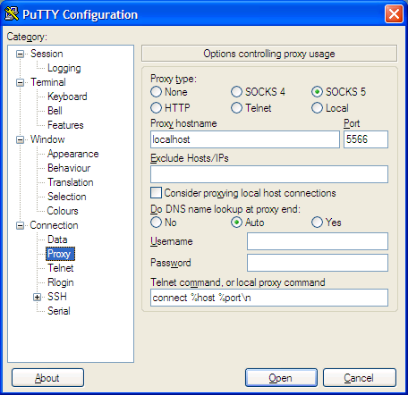{width="4.75in" height="4.602083333333334in"}

Figure Putty proxy
session config

Then all your putty connections from topology viewer will be forwardh
through localhost 5566 port to the hostname and then to the target
device.

############################## Reports 

Reports are a basic html created through a double xslt transformation of
the device xml output file. Each report has two parameters:

-   xsl\_transformator - the xslt file used for the device xml
    transformation into a valid xml table report.

-   table\_transformator - optional parameter that specifies the path to
    the xslt file that creates html table from the xml structure created
    by the previous xslt transformator.

&lt;submenu
name="Reports"&gt;

&lt;rightClickItem name="Device Neighbors"
handlerClass="net.itransformers.topologyviewer.rightclick.impl.XsltReportCreator"&gt;

&lt;param
name="xsl\_transformator"&gt;iTopologyManager/rightClick/conf/xslt/deviceNeighbors.xslt&lt;/param&gt;

&lt;param
name="table\_transformator"&gt;iTopologyManager/rightClick/conf/xslt/table\_creator.xslt&lt;/param&gt;

&lt;/rightClickItem&gt;

&lt;rightClickItem name="Cable Cuts"
handlerClass="net.itransformers.topologyviewer.rightclick.impl.XsltReportCreator"&gt;

&lt;param
name="xsl\_transformator"&gt;iTopologyManager/rightClick/conf/xslt/cableCut.xslt&lt;/param&gt;

&lt;param
name="table\_transformator"&gt;iTopologyManager/rightClick/conf/xslt/table\_creator.xslt&lt;/param&gt;

&lt;/rightClickItem&gt;

&lt;rightClickItem name="IPv4 Address Space"
handlerClass="net.itransformers.topologyviewer.rightclick.impl.XsltReportCreator"&gt;

&lt;param
name="xsl\_transformator"&gt;iTopologyManager/rightClick/conf/xslt/IPv4.xslt&lt;/param&gt;

&lt;param
name="table\_transformator"&gt;iTopologyManager/rightClick/conf/xslt/table\_creator.xslt&lt;/param&gt;

&lt;/rightClickItem&gt;

&lt;rightClickItem name="IPv6 Address Space"
handlerClass="net.itransformers.topologyviewer.rightclick.impl.XsltReportCreator"&gt;

&lt;param
name="xsl\_transformator"&gt;iTopologyManager/rightClick/conf/xslt/IPv6.xslt&lt;/param&gt;

&lt;param
name="table\_transformator"&gt;iTopologyManager/rightClick/conf/xslt/table\_creator.xslt&lt;/param&gt;

&lt;/rightClickItem&gt;

&lt;rightClickItem name="MPLS L3 VPN"
handlerClass="net.itransformers.topologyviewer.rightclick.impl.XsltReportCreator"&gt;

&lt;param
name="xsl\_transformator"&gt;iTopologyManager/rightClick/conf/xslt/mplsL3VPN.xslt&lt;/param&gt;

&lt;param
name="table\_transformator"&gt;iTopologyManager/rightClick/conf/xslt/table\_creator.xslt&lt;/param&gt;

&lt;/rightClickItem&gt;

&lt;/submenu&gt;

Config Example topology viewer - Reports submenu

##############################  Node&Path Activation rightclick

This is the RightClick where are combined parameterFactory,
ResourceManager and the fulfillmentFactory. Therefore the only
parameters it requires are the paths to:

-   parameterFactoryXml - local path to ParameterFactory xml
    configuration file

-   Resource - local path to Resource xml configuration file

-   fulfillment-factory - local path to fulfillment factory xml
    configuration file

&lt;rightClickItem name="nodeActivation"
handlerClass="com.topolgyviewer.rightclick.impl.CmdRightClickHandler"&gt;

&lt;param
name="parameterFactoryXml"&gt;parameter-factory/conf/xml/param-factory.xml&lt;/param&gt;

&lt;param
name="resource"&gt;resource-manager/conf/xml/resource.xml&lt;/param&gt;

&lt;param
name="fulfilment-factory"&gt;fulfilment-factory/conf/xml/fulfilment-factory.xml&lt;/param&gt;

&lt;/rightClickItem&gt;

############################## Graph Data Management

############################## ObjectTreeBrowser

&lt;rightClickItem name="Object Tree Browser"
handlerClass="com.topolgyviewer.rightclick.impl.XMLTreeViewHandler"

&lt;/ rightClickItem &gt;

Config Example -
ObjectTreeBrowser

#### Graphml Xml viewer

#### RawData Xml viewer

#### Device Xml viewer

Configure logging
-----------------

netTransformer and its modules use log4j for event logging. Each module
has its own log file. An example log4j properties file is presented
below.

\#log4j.properties

\# Set root logger level to DEBUG and its only appender to CONSOLE.

log4j.rootLogger=DEBUG, CONSOLE

\# CONSOLE is set to be a ConsoleAppender.

log4j.appender.CONSOLE=org.apache.log4j.ConsoleAppender

log4j.appender.CONSOLE.layout=org.apache.log4j.PatternLayout

\#log4j.appender.CONSOLE.layout.ConversionPattern=%-4r \[%t\] %-5p %c %x
- %m%n

log4j.appender.CONSOLE.layout.ConversionPattern=%d{MM-dd@HH:mm:ss} %-5p
(%13F:%L) %3x - %m%n

log4j.appender.FILE1=org.apache.log4j.FileAppender

log4j.appender.FILE1.File=discovery.log

log4j.appender.FILE1.layout=org.apache.log4j.PatternLayout

log4j.appender.FILE1.layout.ConversionPattern=%d{MM-dd@HH:mm:ss} %-5p
(%13F:%L) %3x - %m%n

\# CONSOLE uses PatternLayout.

log4j.appender.FILE2=org.apache.log4j.FileAppender

log4j.appender.FILE2.File=topology.log

log4j.appender.FILE2.layout=org.apache.log4j.PatternLayout

log4j.appender.FILE2.layout.ConversionPattern=%d{MM-dd@HH:mm:ss} %-5p
(%13F:%L) %3x - %m%n

log4j.appender.FILE3=org.apache.log4j.FileAppender

log4j.appender.FILE3.File=parameter-factory.log

log4j.appender.FILE3.layout=org.apache.log4j.PatternLayout

log4j.appender.FILE3.layout.ConversionPattern=%d{MM-dd@HH:mm:ss} %-5p
(%13F:%L) %3x - %m%n

log4j.appender.FILE4=org.apache.log4j.FileAppender

log4j.appender.FILE4.File=resource-manager.log

log4j.appender.FILE4.layout=org.apache.log4j.PatternLayout

log4j.appender.FILE4.layout.ConversionPattern=%d{MM-dd@HH:mm:ss} %-5p
(%13F:%L) %3x - %m%n

log4j.appender.FILE5=org.apache.log4j.FileAppender

log4j.appender.FILE5.File=fulfilment-factory.log

log4j.appender.FILE5.layout=org.apache.log4j.PatternLayout

log4j.appender.FILE5.layout.ConversionPattern=%d{MM-dd@HH:mm:ss} %-5p
(%13F:%L) %3x - %m%n

\# Print only messages of level WARN or above in the package com.foo.

log4j.logger.com.discovery.core=DEBUG, FILE1

log4j.logger.com.snmpdiscoverer.MibLoaderHolder=DEBUG, CONSOLE, FILE1

\#log4j.logger.org.apache.commons.beanutils=INFO, CONSOLE

log4j.logger.org.snmp4j=DEBUG, FILE1

log4j.logger.com.snmpdiscoverer.Walk=DEBUG, FILE1

log4j.logger.com.discovery.discoveryhelpers.xml.SnmpGetNameForXslt=DEBUG,
FILE1

log4j.logger.com.snmpdiscoverer.transport.LogBasedTransportMapping1=DEBUG,
FILE1

log4j.logger.com.snmpdiscoverer.messagedispacher.LogBasedMessageDispatcherFactory=DEBUG,
FILE1

log4j.logger.com.snmpdiscoverer=DEBUG, FILE1

\# Print only messages of level WARN or above in the package com.foo.

log4j.logger.com.topolgyviewer=DEBUG,FILE2

log4j.logger.com.XmlParamFactoryElement=DEBUG,FILE3

log4j.logger.com.ResourceManager=DEBUG,FILE4

More about log4j could be found at
<http://logging.apache.org/log4j/1.2/manual.html>.

Getting an additional information
=================================

[netTransformer](http://itransformers.net/wiki/iTransformer) comes with
a number of ready to use features. It is distributed under an open (GPL
v3). For more information please visit also our [YouTube
channel](http://www.youtube.com/channel/UCVrXTSM9Hj6d3OFbIdF4Z2w?feature=watch).

If you still feel uncomfortable about something and something or have
any other questions please visit our web page
[http://iTransformers.net](http://itransformers.net/) and do not
hesitate to contact us on
[info@iTransformers.net](mailto:info@itransformers.net)

